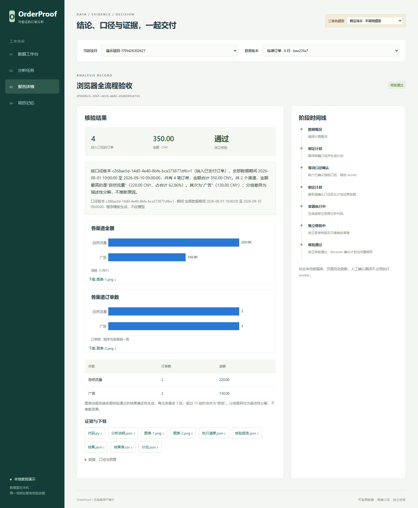
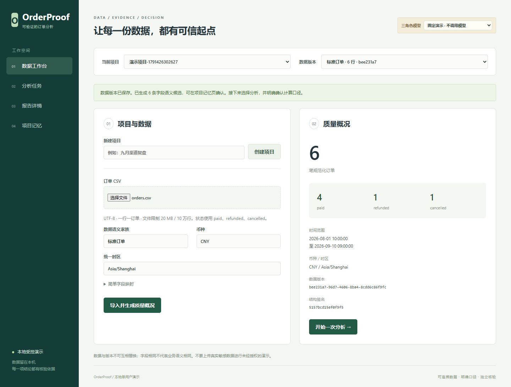
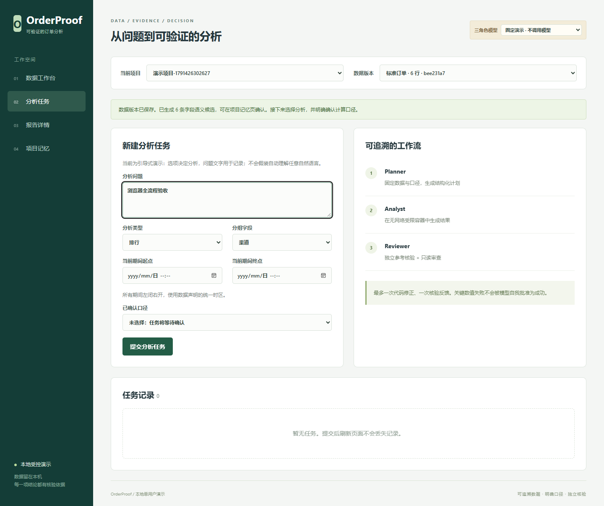
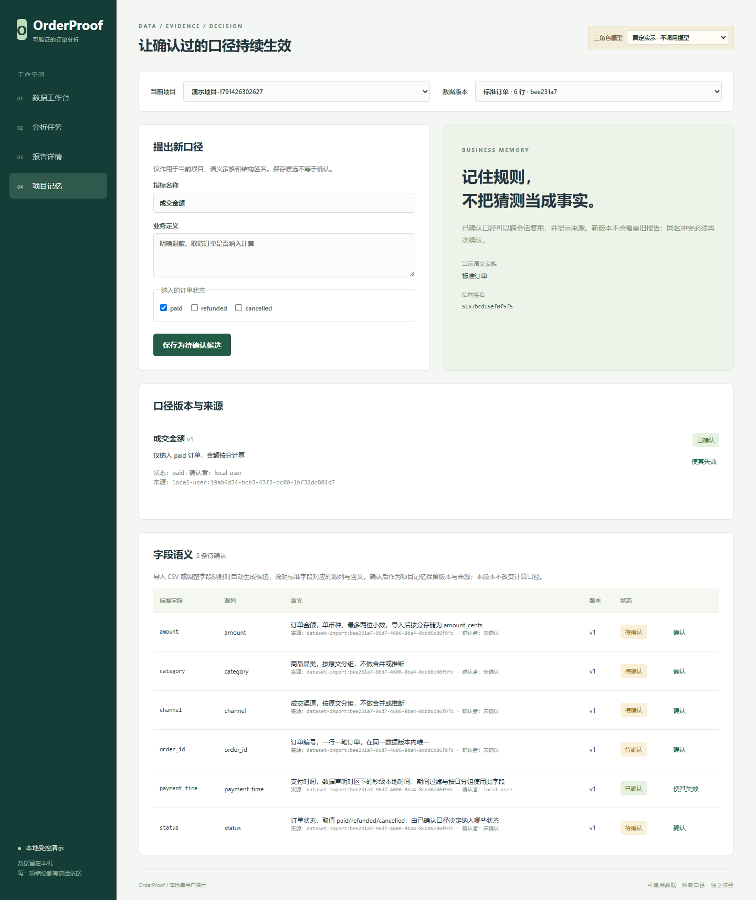
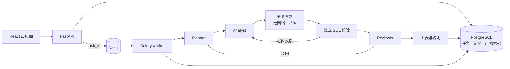

# OrderProof

> 面向电商订单 CSV 的多角色数据分析助手：数值经独立 SQL 复算才算成功，业务口径必须由用户确认，生成代码只在无网络的受限容器中运行。

[](https://github.com/control-coder/orderproof/actions/workflows/ci.yml)


> [!IMPORTANT]
> 本项目是单用户、本机回环地址上的工程原型，只使用模拟订单验证过。它不是公网多租户服务，没有身份认证；只做描述性统计，不做预测或因果推断。

## 项目简介

用户上传订单 CSV 并用自然语言提问，例如“八月各渠道成交额排行”。Planner 制定分析计划，Analyst 编写分析函数并在受限容器中执行，Reviewer 检查计划是否读对了问题。最终输出结果表、最多三张图表、模板化说明、代码与核验报告。

项目重点在三件事：

- **独立核验**：容器产出的任何数值都不可信。宿主用独立 SQL 参考复算结果，并逐行比对下载表；核验不通过就不算成功，Reviewer 也不能放行。
- **口径由人确认**：“成交额是否含退款”这类业务规则存放在带版本的业务记忆中，确认后才会被使用；缺少口径时任务停下等待确认，不让模型去猜。评测中，由模型自定口径时只有 4/16 正确，而且错误结果能通过数值核验。
- **受限执行**：生成代码运行在专用 Docker 容器中，非 root、无网络、只读根文件系统，CPU、内存、进程数、时间与输出大小都有限制；不会回退到宿主执行。

## 功能特性

- 六类分析：汇总、趋势、排行、占比、期间对比、数据质量；支持按渠道、品类、日期分组，期间左闭右开。
- Planner、Analyst、Reviewer 三角色上下文独立，工具按角色白名单绑定；代码修正和核验反馈各最多一次，调用次数、token 与时长有预算上限。
- 核验失败时，只向 Analyst 返回错误位置（字段路径、行列），不返回期望值；Reviewer 失败时跳过审查，采用已通过核验的结果。
- 业务记忆：按项目、数据家族与 schema 隔离，支持待确认、确认、替代、失效与并发冲突检测；报告保留口径快照。
- 核验通过后，服务端确定性生成图表与 2–3 句说明，说明中写明口径版本与期间。
- 模型可选 MiMo 或 DeepSeek（OpenAI 兼容接口），也可以用不调用模型的固定演示模式，一条命令即可切换。
- FastAPI + PostgreSQL + Redis/Celery：数据库是任务状态的权威，用租约处理重复投递，租约过期后从检查点恢复一次，任务创建支持 Idempotency-Key（前端在重试时沿用同一个键），投递失败自动补发，取消与终态提交通过行锁协调。
- React + TypeScript 四页面：数据工作台、分析任务、报告详情、项目记忆。

## 界面

以下截图由浏览器流程测试在固定演示模式（不调用模型）下自动生成，数据是 6 行模拟订单。



<details>
<summary>其余三页：数据工作台、分析任务、项目记忆</summary>







</details>

重新生成：服务启动后运行 `DATALAB_SHOT_DIR=docs/images node frontend/tests/browser-flow.mjs`（需要本机 Edge）。

## 架构



角色权限、状态机、执行隔离、记忆治理与安全边界见 [docs/architecture.md](docs/architecture.md)。

## 快速开始

环境要求：Python 3.12（conda）、Node.js、可运行 Linux 容器的 Docker。固定演示模式不需要 API Key。

```powershell
# 1. 安装
conda env create -f environment.yml
conda activate datalab
python -m pip install --no-build-isolation -e .
npm ci --prefix frontend
npm run build --prefix frontend
docker build -t datalab-executor:py312-v1 -f scripts/executor/Dockerfile .

# 2. 启动本项目专用的 PostgreSQL/Redis（回环随机端口），然后启动应用
python -B scripts/local_services.py start
python -B scripts/serve.py
```

打开 <http://127.0.0.1:18080>：

1. 在“数据工作台”上传 `examples/orders.csv`。
2. 在“分析任务”提交一个任务；没有确认口径时，任务会等待确认。
3. 在“项目记忆”确认“只含 paid”的口径。
4. 回到“报告详情”选择该口径继续。

接入真实模型时，先复制 `.env.example` 为 `.env` 并填写密钥，再运行 `python -B scripts/switch_model.py mimo`。镜像源、模型配置与排障见 [docs/development.md](docs/development.md)。

## 测试

```powershell
python -m ruff check src tests scripts evals
python -B -m unittest discover -s tests/datalab -v
npm run build --prefix frontend
```

CI 在每次推送到 `main` 和每个 Pull Request 时运行以上三项，并在独立作业中用服务容器跑真实 Docker 沙箱隔离、PostgreSQL、Celery 应用集成和固定种子评测（不调用模型）。Edge 浏览器流程需要本机运行，见 [开发与运行](docs/development.md#测试)。

## 评测结果

评测分两层，完整方法、迭代过程与失败案例见 [docs/evaluation.md](docs/evaluation.md)。

**留出集（主要结果）**：24 道冻结题（题面与真值计划的 SHA-256 写在代码里，改题会让测试失败）× 5 批 × 2 个模型 × 单 Agent / 三角色，共 480 例。正确率区间为以题为单位的 95% Wilson；倍数为按题聚类自助法的中位值与 95% 区间。

| 模型 | 对照 | 正确率 | 首次即对 | 核验通过但错 | 中位 / p90 时延（秒） |
| --- | --- | --- | --- | --- | --- |
| MiMo | 单 Agent | 100% [86.2, 100] | 99.2% | 0 | 13.6 / 21.7 |
| MiMo | 三角色 | 100% [86.2, 100] | 96.7% | 0 | 32.7 / 70.6 |
| DeepSeek | 单 Agent | 100% [86.2, 100] | 100% | 0 | 7.5 / 13.9 |
| DeepSeek | 三角色（优化前） | 99.2% [84.8, 100] | 86.7% | 0 | 17.7 / 38.6 |
| DeepSeek | 三角色（优化后，复测） | 98.3%（118/120，未按题算区间） | 95.8% | 0 | 未单列 / 28.9 |

- **三角色没有换来正确率收益，成本可以量化**：三角色相对单 Agent 的中位费用约 1.4 倍（MiMo）和 2.2 倍（DeepSeek），中位时延约 2.2 倍。24 题全对时 Wilson 下界只有约 86%，所以只能说“没有观察到可确认的差异”，不能说“等价”。据此 Reviewer 被改为咨询性审查：失败即跳过，采用已通过核验的结果。
- **定位并修复了成本尾部**：DeepSeek 三角色的重试集中在“给趋势、排行类结果多写了 `share` 等键”。“交接内容让 Analyst 多想”这一假设经 160 次重放被否定；改为由服务端框架按分析类型删除多余键（只删不改，数值仍由独立核验）后，需要重试的任务从 15/120 降到 3/120，首次即对 86.7% → 95.8%，均费降约 10%，p90 时延降约 25%。
- **业务记忆管的是口径**：开发题集上，有 Memory 的 8 例全部正确，由模型自定口径的 16 例里只有 4 例正确，其余结果能通过数值核验。这组对照没有在留出集上重做。
- **信息流检查**：金丝雀提示注入测试发现并关闭了 3 条不可信文本进入提示的路径（改为字段白名单与封闭词表），每次角色调用记录交接的哈希与字段路径。测试证明的是字段级信息流，不是模型对注入免疫。白名单收紧后没有用真实模型重测准确率。
- **其他检查**：全链路冒烟（API、Celery、受限容器、独立核验到图表说明）两个模型六类问题各 6/6；固定种子评测（不调用模型）数值 20/20、记忆 8/8、故障 8/8，并在 CI 的 Linux runner 上运行。

局限：24 题、合成数据、两个 flash 级模型，每个对照只有一个提示词指纹；部分提示调整来自开发题集；留出集上有 1 例静默错误（MiMo 单 Agent 把“9 月上半月”读成整月），样本太少，不能据此说明 Reviewer 有统计意义上的收益。

## 项目结构

```text
src/datalab/
  api/            HTTP 接口、访问约束、产物下载
  datasets/       CSV 规范化、字段映射、质量检查、数据版本
  orchestration/  状态机、预算、Celery worker、租约与补发
  roles/          三角色运行时、提示、固定演示后端、模型适配
  memory/         业务记忆的版本、确认与冲突（PostgreSQL）
  execution/      六类分析、代码框架、Docker runner
  verification/   独立 SQL 参考与下载表比对
  artifacts/      图表与模板说明
  storage/        项目、任务与产物索引
frontend/         React + TypeScript + Vite 四页面与浏览器流程测试
scripts/          本地服务、启动、模型切换、集成与规模验证；executor/ 为执行镜像
evals/            固定种子评测与真实模型对照、重放、全链路冒烟
examples/         模拟订单样例
tests/datalab/    单元与集成测试
```

内部 Python 包、conda 环境与执行镜像沿用早期名称 `datalab`。

## 文档

| 文档 | 内容 |
| --- | --- |
| [架构与取舍](docs/architecture.md) | 模块、三角色与状态机、受限执行、业务记忆、任务持久化、图表与安全边界 |
| [API 与前端行为](docs/api.md) | 接口、访问约束、任务参数与错误语义 |
| [开发与运行](docs/development.md) | 安装、启动、模型配置、测试开关、CI 与排障 |
| [评测与验证](docs/evaluation.md) | 判定口径、当前结果、迭代过程、失败案例与局限 |

## 局限

- 只支持单表订单 CSV（单币种、统一时区、不支持部分退款），最多 20 MB、10 万行，以及六类固定分析。
- 仅限本机单用户：写接口只校验 Host、Origin 和客户端标识，没有身份认证与授权，不能直接暴露到公网。
- 评测规模小、数据为合成，部分提示调整来自同一题集；“驳回后交回 Planner 复核”和“审查降级”两条路径只有离线测试覆盖。
- 只在一台 Windows 主机上验证过；宿主进程崩溃后的遗留容器需要人工清理；图表的字节级可复现性依赖字体。

## 许可证

本项目代码采用 [MIT License](LICENSE)。设计参考与运行依赖的说明见 [THIRD_PARTY_NOTICES.md](THIRD_PARTY_NOTICES.md)。
