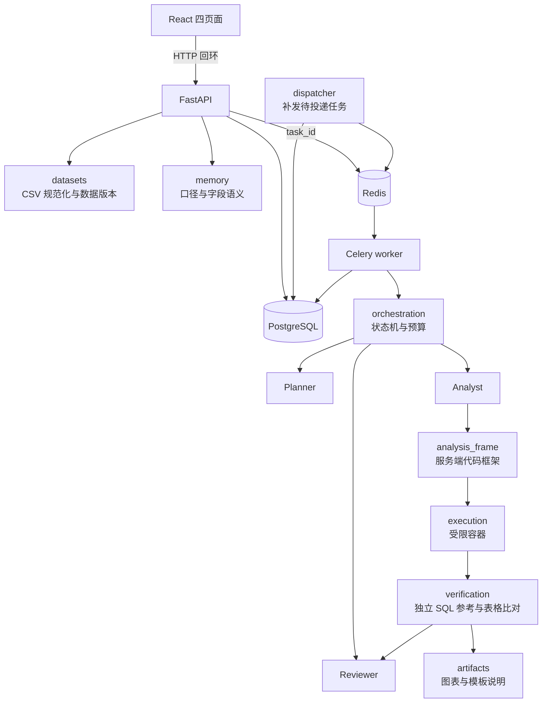
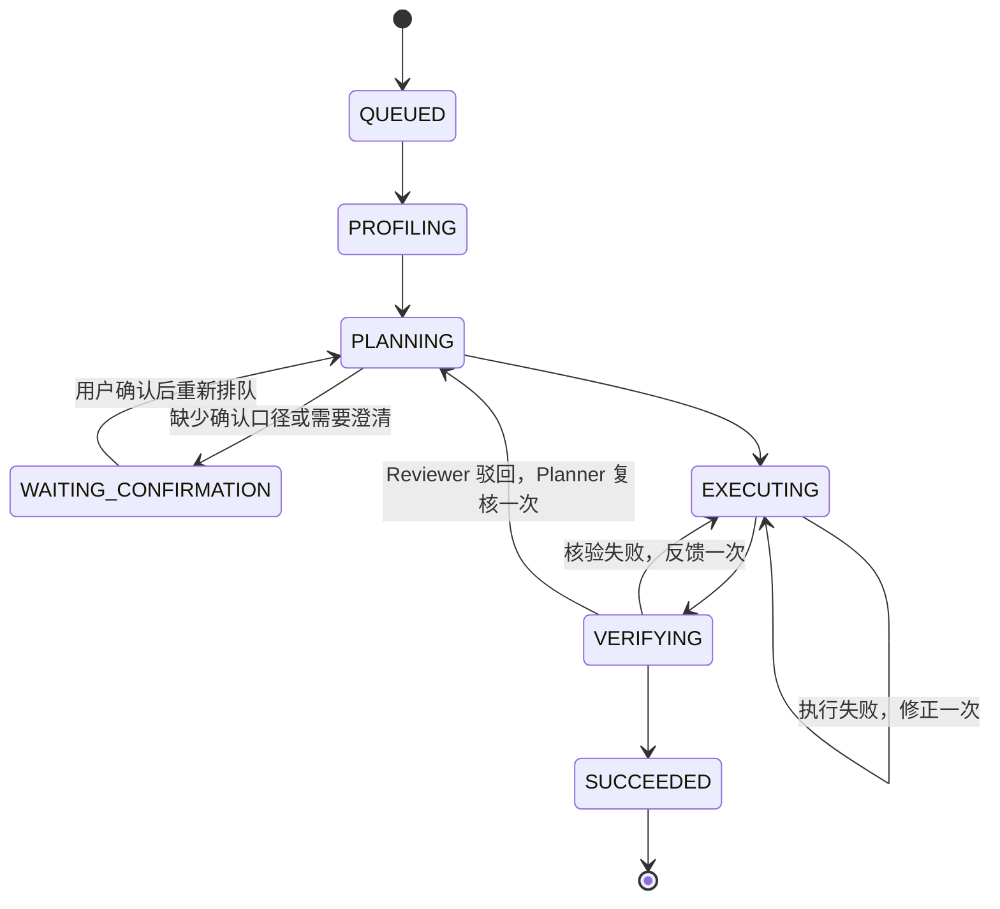

# 架构与取舍

OrderProof 是模块化单体：FastAPI 接口、Celery worker 与领域工作流在同一个 Python 包 `datalab` 中，按职责分模块，不拆微服务。PostgreSQL 是数据版本、业务记忆、任务状态与产物索引的唯一权威；Redis 只携带任务 ID；生成的分析代码只在专用的无网络 Docker 容器中执行。

## 模块

| 模块 | 职责 |
| --- | --- |
| `api/` | HTTP 接口、请求体上限、Host 与写入来源校验、产物下载 |
| `datasets/` | 标准 CSV 模板与字段映射、质量检查、数据版本与 schema 签名 |
| `orchestration/` | 任务状态机、有界修正、Celery worker、租约与补发 |
| `roles/` | 三角色运行时与工具白名单、固定演示后端、OpenAI 兼容模型适配与提示 |
| `memory/` | 业务记忆的范围、版本、确认、失效与冲突，PostgreSQL 实现 |
| `execution/` | 六类固定分析、代码框架组装、Docker runner 与容器内收集器 |
| `verification/` | 独立 SQL 参考复算与下载表比对 |
| `artifacts/` | 核验通过后的确定性图表与模板化说明 |
| `storage/` | 项目、数据集、任务快照与产物索引 |

业务范围：UTF-8 CSV，一行一笔订单，字段为订单编号、支付时间、金额、状态、渠道、品类；单文件最多 20 MB、10 万行；单币种、统一时区，不支持部分退款。分析类型为汇总（summary）、趋势（trend）、排行（ranking）、占比（share）、期间对比（comparison）与数据质量（quality）。不做任意 Excel/PDF、联网、数据库直连、多表关联、预测、机器学习建模或因果推断；分组说明只是描述性分解。

## 三角色与状态

### 上下文与权限

每次调用都深复制显式交接，角色之间不共享聊天历史，也不发送订单明细。

| 角色 | 接收 | 输出 | 权限 |
| --- | --- | --- | --- |
| Planner | 问题、数据概况（聚合统计）、已确认口径快照 | `plan` 或 `confirmation` | 无执行权限；不能更换数据版本、指标版本或纳入状态 |
| Analyst | 计划、尝试产物 ID、必要反馈 | 只写 `analyze(data, plan)` 函数 | 代码只进入受限容器 |
| Reviewer | 问题、数据概况、计划、产物 ID、核验检查名与结论 | `accepted` 与 `feedback` | 不执行代码；收不到独立参考数值 |

服务端 `BoundTools` 把角色和当前任务绑定到固定工具白名单；模型响应不能声明自身身份、启用 bash 或传入工具注册表。计划常量、CSV 读写、编码与公式注入防护由 `execution/analysis_frame.py` 生成，组装后的脚本仍进入同一容器并接受独立核验。角色交接中的计划不带 `checks`，核验项由服务端决定。

### 模型可见字段与 trace

模型看到的概况与口径是白名单视图（`model_profile`、`model_metric`）：概况只含行数、状态计数、起止时间、币种与时区，并逐字段校验类型与格式；口径只含版本号与纳入状态。数据语义家族、结构签名、口径来源、项目标识这些自由文本或内部标识只用于服务端的范围校验，不进入提示。核验反馈中的字段路径也只保留输出契约内的键名（`RESULT_KEYS`）与数组下标，其余键换成 `<key>`：路径来自模型代码写出的 `result.json`，键名可能取自订单文本。模型能看到的自由文本只剩用户的问题，这是用户自己的输入，边界由输出侧校验把住：计划的纳入状态和版本必须等于已确认口径，否则任务失败且不执行。

每次角色调用在任务里追加一条 trace：序号、角色、所处状态、交接的 SHA-256 与字段路径清单、模型用量、耗时和结果类别（成功或异常类名）。不保存提示、响应或数据内容。trace 随任务快照落库，并写入核验报告，用来事后核对某次调用实际能看到哪些字段。`tests/datalab/test_prompt_injection.py` 用金丝雀检查这一点，见 [评测与验证](evaluation.md)。

### 状态机

任一非终态都可以进入 `FAILED` 或 `CANCELLED`；失败原因记录为失败码，如 `MODEL_ERROR`、`REVIEW_REJECTED`。

- 缺少确认口径时进入 `WAITING_CONFIRMATION` 并释放 worker；确认快照保存后从计划边界重新排队。等待期间不计时，恢复后已用的调用、token 和时间不归零。
- 预算：固定演示默认 6 次调用、12000 token、120 秒；模型任务由 `.env` 配置，默认 6 次、15 万 token、600 秒。单次请求超时取供应商超时与剩余预算的较小值，不自动重试。
- 代码执行失败最多修正一次。独立核验失败时，程序把定位信息直接回传 Analyst，最多一次，不调用 Reviewer。反馈只给出错误位置，不给期望值：`independent_reference` 报告不一致的字段路径与类型（如 `comparison.growth` 的 value、`total.order_count` 的 type），`download_table` 报告文件缺失、列顺序错误、列不符、行数不符或具体行列；转发前按白名单只保留定位字段。
- Reviewer 只在核验通过后调用，只判断计划是否读对问题（类型、分组、期间），不审查口径、核验项或数值。驳回交回 Planner 复核：维持原计划则采用已通过核验的结果并把意见记入时间线；给出新计划则重新执行、核验和审查，再次驳回则以失败码 `REVIEW_REJECTED` 失败。
- 审查是咨询性的。Reviewer 或复核 Planner 超时、截断、连接失败、输出不合契约或预算耗尽时，跳过审查并记录 `review_skipped`，采用已通过独立核验的结果。Reviewer 单独使用较低输出上限（默认 2048 token）和较短超时（默认 60 秒）。
- Planner 或 Analyst 调用异常、输出不合契约时以 `MODEL_ERROR` 失败；错误信息不含密钥或响应原文。即使 Reviewer 接受，独立核验不通过也不能成功。

## 受限执行

可信宿主 runner 管理 Docker；生成代码只在专用镜像 `datalab-executor:py312-v1` 中执行，没有宿主执行降级。

- 挂载：只读挂载本次复制的规范化 CSV、分析代码与收集器；不挂载工作区、原始数据目录、Docker socket 或凭据。每次尝试使用新的 UUID 目录和随机容器名。
- 隔离：非 root、默认 seccomp、丢弃全部 capabilities、禁止权限提升、无网络、只读根文件系统；CPU 1 核、内存 256 MB 且无额外 swap、32 个进程、文件描述符上限。只有 16 MB 的 `/output` tmpfs 可写。
- 镜像：运行时不安装依赖；执行前把镜像标签解析为内容 ID，按该 ID 创建容器并写入执行清单，不自动拉取。
- 输出：stdout/stderr 不直接暴露。收集器只读取白名单内的平面普通文件，拒绝符号链接和硬链接，经受限 JSON/base64 通道返回；宿主再次检查字段、文件名和解码后大小，总输出上限 8 MB。
- 生命周期：超时、取消、异常都会强制移除本次容器；无法确认清理时标为 `CLEANUP_PENDING`，不返回成功。容器正常退出只记 `COMPLETED`，不等于分析成功。

容器内产生的任何字节都不可信。数值正确性由宿主的独立 SQL 参考复算 `result.json`，并独立比对下载 CSV。

## 业务记忆

- 范围：每条记忆都属于 `project_id`、`dataset_family` 与 `schema_signature`，先过滤范围再检索。数据家族描述语义，不从 schema 自动推断；字段相同但语义不同时必须重新确认。
- 生命周期：指标口径与字段语义先以 `pending` 写入，只有用户明确确认或可信预配置后才能被默认使用；新版本确认后旧版本变为 `superseded`，内容不覆盖；失效标记 `invalidated` 并记录操作人和时间。默认检索只返回已确认且生效的条目，数值计算只从已确认的 metric 建立快照，报告保留快照，重放时不会重新选择“最新”口径。
- 并发：确认时必须带上看到的当前 `memory_id`；页面旧版本或并发确认触发 `MemoryConflict`（HTTP 409）。每个范围使用短事务与事务级咨询锁，同名当前确认版本有部分唯一索引，SQL 全部参数绑定。
- 字段语义：上传 CSV 时按字段映射写入 `field_semantics` 待确认候选，内容相同时不重复写版本。当前版本中字段语义只作可追溯记录，不进入 Planner 交接或计算。
- `initialize()` 建表并用 `ADD COLUMN IF NOT EXISTS` 补齐后加的列，可重复执行；它不是通用迁移工具，改列类型或删列需要显式迁移。

## 任务持久化与派发

- 任务快照、状态与产物索引在 PostgreSQL 中；Redis/Celery 只传任务 ID。
- worker 通过数据库租约（30 秒，心跳续期）领取任务，重复投递由原子租约去重；旧 worker 不能覆盖终态。每次领取同时把任务行的 `fence` 加一。
- 投递失败时任务保留为待执行，dispatcher（Celery beat，每 5 秒）从数据库补发。
- 租约过期的处理（2026-10 起）：此前一律标为失败；现在按检查点恢复，每个任务最多一次。
  - 检查点就是每次状态转换时落库的任务快照，另外保存了下一次 Analyst 调用要带的定位反馈。dispatcher 发现租约过期后，把任务重新排队并在时间线写一条记录，新 worker 领取后调用 `Workflow.recover`，按快照状态接续：规划中重新规划；执行中带着保存的反馈重新生成并执行代码；核验中直接重跑确定性的独立核验，不再调用 Analyst。
  - 不恢复容器里跑了一半的 Python：半成品不可复用，重新生成代码。已用的调用、token 和时间不归零；检查点之后那次在途调用的用量没有落库，所以恢复后可能少记最多一次调用。Reviewer 若在崩溃前已被调用，恢复后会再调用一次。
  - 恢复次数用尽后再次过期，仍标为失败（`WORKER_LEASE_EXPIRED`）并保留证据；租约过期时若已有取消请求，按取消收尾。
  - 没有做的：崩溃时遗留的孤儿容器不会被主动回收，依赖容器自身的超时与命名约定；这一点没有专门验证。
- 旧 worker 迟到的写入：任务行的写入都带 `WHERE lease_id=…`，租约失效即被拒绝。租约 UUID 对同一行已经等价于比较令牌，`fence` 的用处在数据库行之外：产物文件无法做条件写，所以报告文件名带 fence（`report.<fence>.json`），旧 worker 的迟到写入落在它自己的文件里，不会覆盖新领取者的；产物索引行登记时同样校验租约，并只允许被更大的 fence 覆盖，下载只认索引。图表和说明由同一份 `result.json` 确定性生成，重复写入内容相同，没有加围栏。
- 任务创建支持 `Idempotency-Key` 请求头：同一项目内相同的键和相同的请求内容返回原任务（响应带 `replayed`），不创建、不派发；相同的键但内容不同返回 422；并发重试由唯一索引和 `ON CONFLICT` 保证只创建一次。键只对任务创建有意义，取消和确认本身对重复请求是幂等的。
- 取消在终态提交前以行锁检查，执行期间通过心跳检查；取消先于成功提交确认时不会发布成功。
- 报告引用数据版本、口径快照、代码、执行清单、核验记录和结果产物 ID。

## 图表与说明

核验通过后，可信 worker 中的 `artifacts/derive.py` 只读取已通过独立核验的 `result.json` 与计划，确定性生成图表与说明；生成失败只写 `derived_error`，不推翻核验结论。

- 图表：matplotlib Agg，最多 3 张 PNG。summary 无图；排行和分组为金额、订单数横向条形，占比额外加占比图；趋势为每日金额折线（只标最高点与末点）和每日订单数柱形，一年内缺失日期按 0 补齐；期间对比为上期/本期金额与订单数；数据质量为各状态订单数。超过 15 组时合并为“其他”。
- 可复现：固定 rcParams、关闭 mathtext、PNG 不写 Software 元数据；同一 `result.json`、matplotlib 次版本与字体输出相同字节。字体随机器变化会导致 PNG 不同。
- 安全：分组名来自用户 CSV，去控制字符、截断后只作纯文本刻度。只有 `.png` 图表允许 `?inline=true` 内联返回，其余产物一律作为附件下载。
- 说明：`artifacts/narrative.py` 按分析类型套固定模板生成 2–3 句中文，每句记录引用的结果字段路径。首句写明口径版本、纳入状态与期间；分组类注明“描述性分解，不推断原因”。

## 安全边界

- 首版是单用户、回环地址上的本地演示，不是公网多租户平台。API 校验项目归属、Host，以及写请求的 Origin 与客户端标识；这个标识不是登录凭据。对公网提供服务前，必须补齐身份认证、授权、CSRF 防护、传输加密和审计。
- 发送给模型的只有问题、聚合概况和已确认口径的白名单视图，不含订单明细，也不含上传时填写的自由文本；表格文本在提示中声明为数据而非指令。防线靠的是“不可信文本没有路径进入提示”，而不是指望模型不被劝服；用户的问题是唯一进入提示的自由文本，模型被它带偏时，输出侧校验仍会拒绝改动口径的计划。这不排除模型在问题范围内读错题意，那类错误由 Reviewer 和独立核验部分覆盖，见评测文档的静默错误率。
- 应用 API、队列和数据库本身不运行在分析沙箱中。若可信宿主进程或本机账户被攻陷，回环地址与普通容器隔离不能保证数据安全。上述描述是实现配置，不是绝对的安全承诺。
